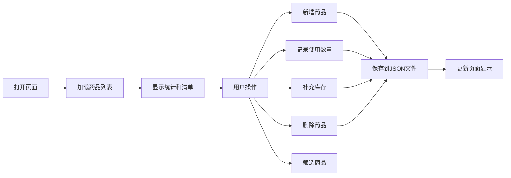

## 1. 产品概述

家庭药箱管理应用，帮助用户记录家中常备药品的数量、有效期和存放位置，及时提醒库存不足和即将过期的药品。
- 主要解决家庭药品管理混乱、过期药品未及时清理、急需用药时找不到等问题
- 目标用户为家庭成员，尤其是负责家庭健康管理的用户
- 产品价值：让家庭用药更安全、更有条理

## 2. 核心功能

### 2.1 用户角色

| 角色 | 注册方式 | 核心权限 |
|------|---------|---------|
| 家庭成员 | 无需注册，直接使用 | 药品的增删改查、库存管理、筛选查看 |

### 2.2 功能模块

1. **药品管理页面**：药品清单展示、新增药品表单、筛选功能、库存操作
2. **提醒功能**：库存不足提醒、临近过期提醒、顶部统计展示

### 2.3 页面详情

| 页面名称 | 模块名称 | 功能描述 |
|---------|---------|---------|
| 药品管理页面 | 顶部区域 | 标题、"需要检查"药品数量统计、用途/位置筛选器 |
| 药品管理页面 | 新增表单 | 药名、用途、数量、单位、有效期、存放位置、备注输入 |
| 药品管理页面 | 药品卡片 | 展示药品详细信息，包含使用/补充/删除操作按钮 |
| 药品管理页面 | 提醒标识 | 数量低于3或有效期少于30天时显示红色提醒标签 |

## 3. 核心流程

用户打开页面 → 查看药品清单和提醒统计 → 可按用途或位置筛选 → 新增药品或操作现有药品（使用/补充/删除）→ 数据自动保存到本地JSON文件

## 4. 用户界面设计

### 4.1 设计风格
- **主色调**：浅蓝色（标题栏）、柔和绿色（按钮）、浅红色（提醒标签）
- **背景**：纯白色
- **按钮风格**：圆角、柔和绿色填充、悬停微加深
- **字体**：无衬线字体，清晰易读
- **布局风格**：卡片式布局，整齐排列，信息层次分明
- **图标**：使用简洁的 emoji 图标增强辨识度

### 4.2 页面设计概述

| 页面名称 | 模块名称 | UI 元素 |
|---------|---------|---------|
| 药品管理页面 | 顶部区域 | 浅蓝色背景标题栏，左侧标题，右侧统计数字 |
| 药品管理页面 | 筛选区 | 下拉选择框，用途和位置两个筛选项 |
| 药品管理页面 | 新增表单 | 白色卡片，标签+输入框排列，绿色提交按钮 |
| 药品管理页面 | 药品卡片 | 白色卡片带浅灰色边框，左上角药名，右上角提醒标签，中间信息列表，底部操作按钮 |
| 药品管理页面 | 提醒标签 | 浅红色背景圆角标签，白色文字"库存不足"或"即将过期" |

### 4.3 响应性
- 桌面端优先设计，药品卡片网格布局（每行3-4个）
- 移动端自适应，卡片自动换行变为单列
- 触摸优化，按钮尺寸适中便于点击

### 4.4 交互细节
- 表单提交后自动清空并刷新列表
- 使用/补充操作弹出简单输入框
- 删除操作前弹出确认提示
- 数据加载时显示简短加载提示
