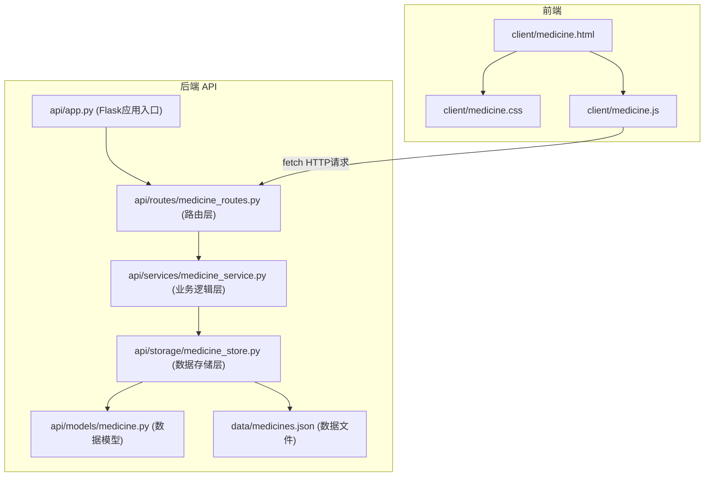
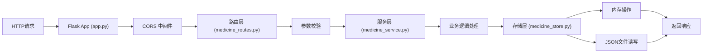
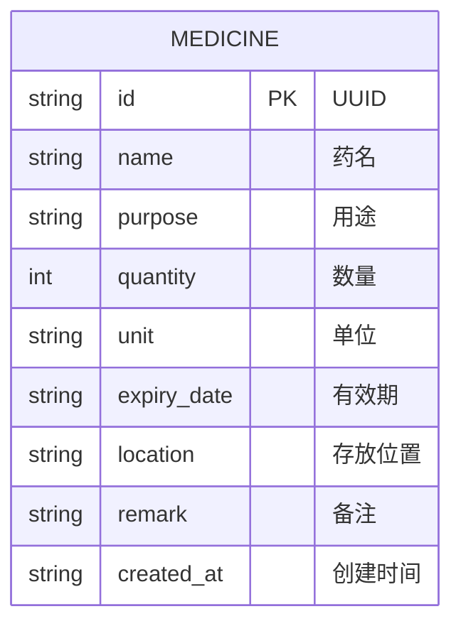

## 1. 架构设计



## 2. 技术描述

- **前端**：HTML5 + CSS3 + 原生 JavaScript (ES6+)，无需框架
- **后端**：Python 3.11.9 + Flask 3.x，轻量级 Web 框架
- **数据存储**：内存存储 + 本地 JSON 文件持久化，无需数据库
- **前后端通信**：RESTful API + JSON 格式，使用 fetch API

## 3. 路由定义

| 路由 | 方法 | 用途 |
|------|------|------|
| `/` | GET | 返回前端页面 |
| `/api/medicines` | GET | 获取药品列表（支持筛选参数） |
| `/api/medicines` | POST | 新增药品 |
| `/api/medicines/<id>` | PUT | 更新药品信息 |
| `/api/medicines/<id>/use` | POST | 记录使用数量 |
| `/api/medicines/<id>/replenish` | POST | 补充库存 |
| `/api/medicines/<id>` | DELETE | 删除药品 |

## 4. API 定义

### 4.1 数据模型

```python
# Medicine 模型
{
    "id": str,           # 唯一标识，UUID
    "name": str,         # 药名
    "purpose": str,      # 用途
    "quantity": int,     # 数量
    "unit": str,         # 单位（片/盒/瓶等）
    "expiry_date": str,  # 有效期（YYYY-MM-DD格式）
    "location": str,     # 存放位置
    "remark": str,       # 备注
    "created_at": str    # 创建时间
}
```

### 4.2 请求/响应格式

**GET /api/medicines?purpose=xxx&location=xxx**
- 响应：
```json
{
    "code": 200,
    "message": "success",
    "data": [
        {
            "id": "uuid-string",
            "name": "阿莫西林",
            "purpose": "抗生素",
            "quantity": 24,
            "unit": "片",
            "expiry_date": "2027-12-31",
            "location": "客厅药箱",
            "remark": "感冒备用",
            "created_at": "2026-06-17T10:00:00",
            "needs_check": false,
            "check_reason": ""
        }
    ],
    "stats": {
        "total": 10,
        "needs_check": 2
    }
}
```

**POST /api/medicines**
- 请求体：
```json
{
    "name": "阿莫西林",
    "purpose": "抗生素",
    "quantity": 24,
    "unit": "片",
    "expiry_date": "2027-12-31",
    "location": "客厅药箱",
    "remark": "感冒备用"
}
```

**POST /api/medicines/<id>/use**
- 请求体：
```json
{
    "amount": 2
}
```

**POST /api/medicines/<id>/replenish**
- 请求体：
```json
{
    "amount": 10
}
```

## 5. 服务器架构图



## 6. 数据模型

### 6.1 数据模型定义



### 6.2 JSON 文件格式

`data/medicines.json` 存储格式：
```json
{
    "medicines": [
        {
            "id": "550e8400-e29b-41d4-a716-446655440000",
            "name": "布洛芬",
            "purpose": "止痛退烧",
            "quantity": 2,
            "unit": "片",
            "expiry_date": "2026-07-15",
            "location": "卧室抽屉",
            "remark": "头痛时用",
            "created_at": "2026-06-17T10:30:00"
        }
    ]
}
```

## 7. 目录结构

```
0044_Project/
├── client/
│   ├── medicine.html    # 前端页面
│   ├── medicine.css     # 样式文件
│   └── medicine.js      # 前端逻辑
├── api/
│   ├── __init__.py
│   ├── app.py           # Flask 应用入口
│   ├── routes/
│   │   ├── __init__.py
│   │   └── medicine_routes.py   # 路由定义
│   ├── services/
│   │   ├── __init__.py
│   │   └── medicine_service.py  # 业务逻辑
│   ├── storage/
│   │   ├── __init__.py
│   │   └── medicine_store.py    # 数据存储
│   └── models/
│       ├── __init__.py
│       └── medicine.py          # 数据模型
├── data/
│   └── medicines.json   # 数据持久化文件
├── requirements.txt     # Python 依赖
└── start.bat            # 启动脚本（Windows）
```
